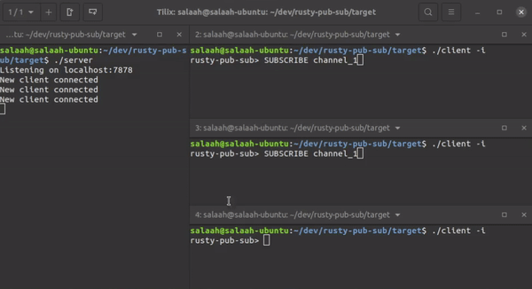

# Rusty Pub-Sub



A simple pub-sub implementation in Rust.

Data will be stored in memory and so will be lost if the program is terminated.

There are two main apps in this project: server and client.

The server is a simple TCP server that listens for connections on a port. It has the ability to accept connections and send data to clients.

Client is a simple TCP client that connects to a server and sends data.

The client is able to subscribe to channels and receive publish messages from the server.

The package comes with two binaries, ones for the server, and one for the client.

## Server
The server will listen for connections on a port. It will accept connections and receive/send data to clients.

To start the server:
```
server [host (default=localhost)] [port (default=7878)]
```

## Client
The client is a simple TCP client that connects to a server and sends/receives data.
Below is the usage for the client:

```
USAGE:
    client [FLAGS] [OPTIONS]

FLAGS:
    -h, --help           Prints help information
    -i, --interactive    Interactive mode
    -l, --listen         Listens continuously for messages from the server
    -p, --ping           Ping the server
    -r, --recv           Waits to receive a message from the server
    -V, --version        Prints version information

OPTIONS:
    -c, --channel <channel>         Channel on which to send a message. If not specified, the message will be sent to
                                    the server without a channel specified
    -H, --host <host>               The hostname of the server [default: localhost]
    -m, --msg <message>             Sends a message to the server
    -P, --port <port>               The port of the server [default: 7878]
    -s, --sub <subscribe>...        Channel to subscribe to
    -u, --unsub <unsubscribe>...    Channel to unsubscribe from
```

## Client Interactive Mode
The client can be run in interactive mode. This will allow the user to stay connected and continue to send messages. This is faster than sending messages one at a time using the cli `-m` command.

To start the client in interactive mode run:

| OS | Command |
| --- | -- |
| Linux | `./client` |
| Windows | `client.exe` |
| OS Independent (using Cargo) | `cargo run --bin client` |

Below is the usage for the client in interactive mode:
```
USAGE:
        [COMMAND] [OPTIONS]

HELP                             Shows this message
EXIT                             Exits program
PING                             Pings the server
SUBSCRIBE [channel]              Subscribes to a channel
UNSUBSCRIBE [channel]            Unsubscribes from a channel
PUBLISH [channel] [message]      Publishes a message to a channel
SEND [message]                   Publishes a message to the server
RECV                             Receives a message from the server
LISTEN
```

## Testing
To test the server, ensure that something is running on port 8080 that is accepting connections. This is needed to test sending messages from a `TcpStream` (client).
Then run:
```
cargo test
```
